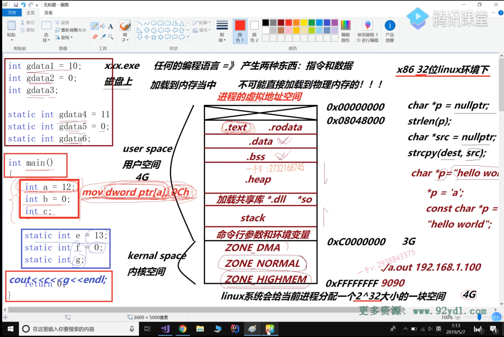

# 进程虚拟地址空间区域划分

- 任何编程语言--> 产生两种东西：指令和数据
- 程序运行时
    - 把程序从硬盘加载到内存中 【但不可能直接加载到物理内存】
    - Linux x86 内核会给当前进程 分配2^32的空间【4G】--->进程的虚拟地址空间
        - user space 用户空间 【0x00000000~0xC0000000】
            - .text代码指令段
            - .rodata只读数据
            - .data初始化数据
            - .bss未初始化数据
            - heap 堆
            - .dll .so 动态库
            - stack 栈 函数运行的栈空间
            - 命令行参数和环境变量
        - kernal space 内核空间【0xC0000000~0xFFFFFFFF】
            - ZONE_DMA 
            - ZONE_NORMAL
            - ZONE_HIGHMEM
    - 每个进行的用户空间是私有的，内核空间是共享的

        

       
