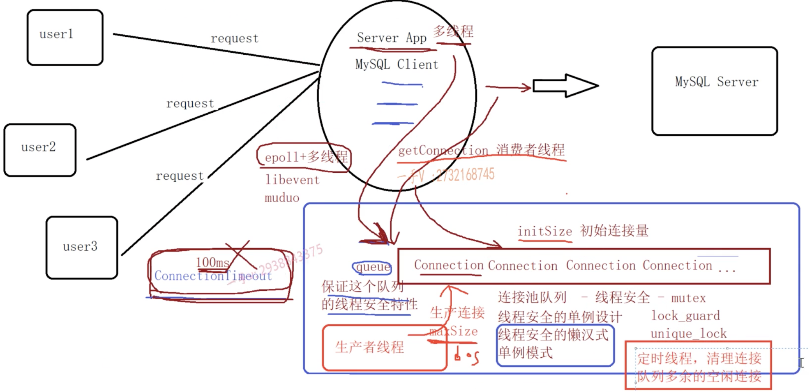

# mysql连接池

- 在高并发情况下，频繁的创建和销毁数据库连接，会大大降低系统的吞吐量。
  - 大量的TCP三次握手
  - mysql server认证
  - mysql server关闭连接回收资源
  - TCP四次挥手

- 连接池：
  - 预先在数据库中建立多个连接，放入连接池中，当用户需要访问数据库时，直接从连接池中获取一个可用连接，
    用户用完后将连接放回连接池中。
  - 主要参数：
    - 初始连接量 initSize
    - 最大连接量 maxSize
    - 最大空闲时间 maxIdleTime
    - 连接超时时间 connectionTimeout
  - 功能点：
    - 连接池:只需要一个实例，单例模式【线程安全：懒汉式单例模式】
    - 连接获取：从连接池中获取一个连接
    - 连接归还：将连接放回连接池中
    - 连接释放：超过最大空闲时间，将连接释放
    - 连接验证：连接池中连接的可用性验证

