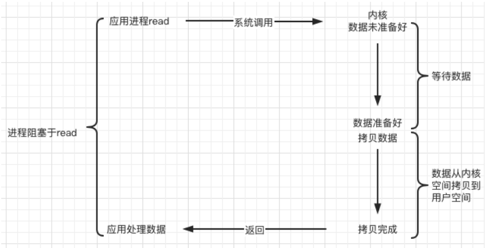
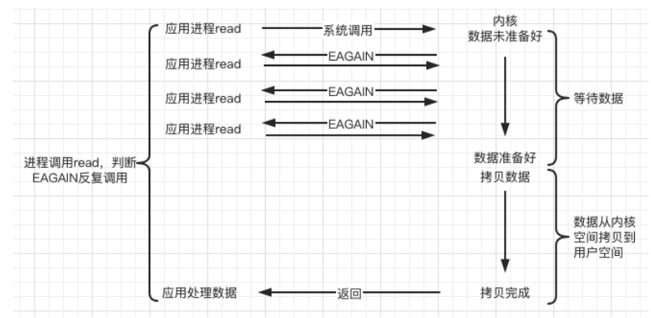
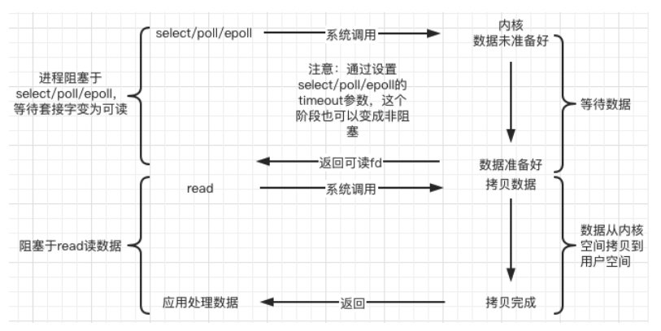
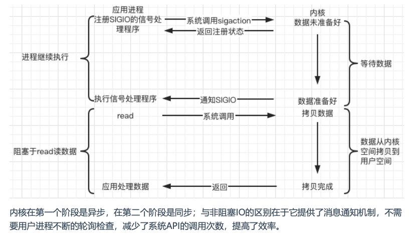
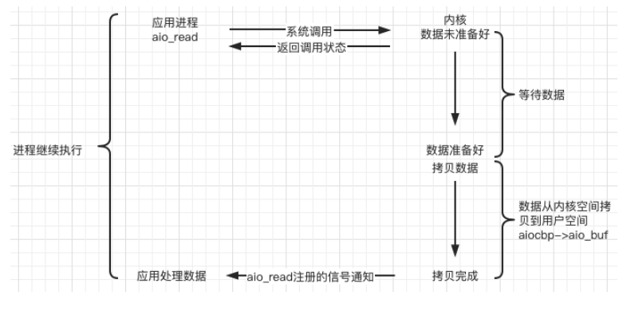
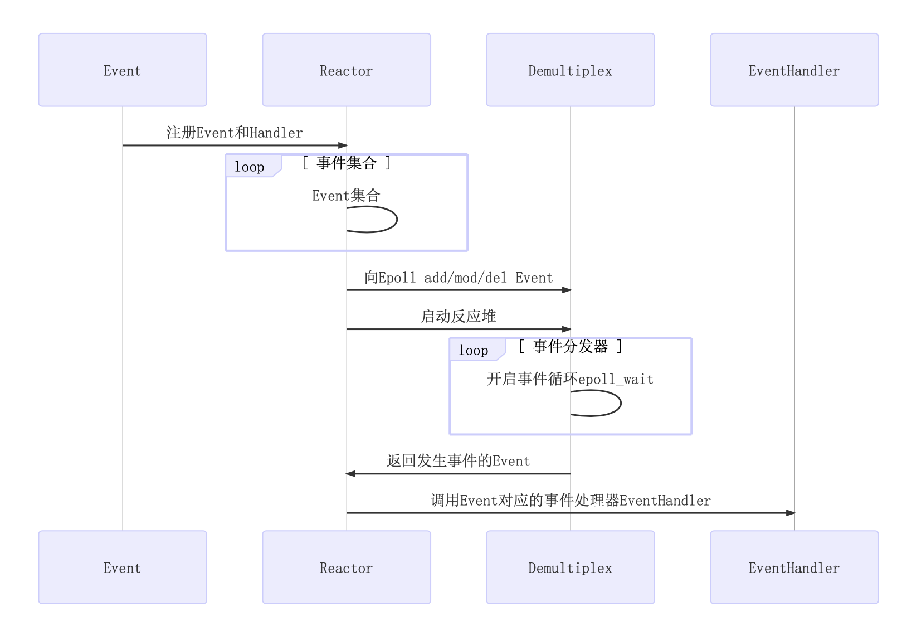
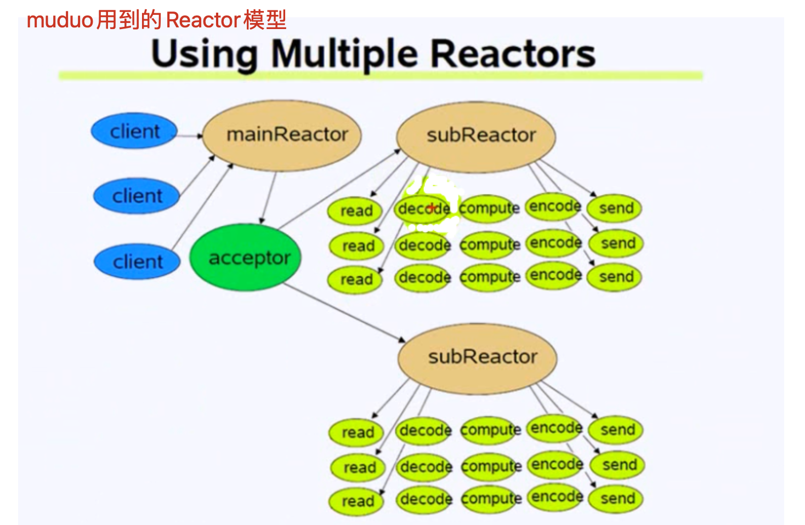
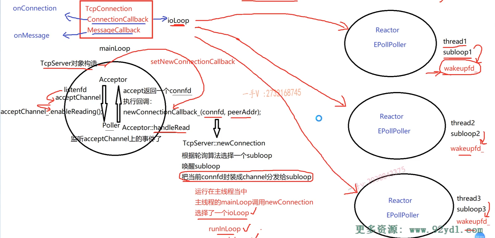

# 学习核心
1. 理解阻塞、非阻塞、同步、异步
2. 理解Unix/Linux上的五种I/O模型
3. epoll的原理及优势
4. 深刻理解Reactor模型
5. 从开源c++网络库，学习优秀的代码设计
6. 掌握基于事件驱动、和事件回调的epoll + 线程池面向对象编程
7. 通过深入了解muduo源码，加深对相关项目理解
8. 改造muduo，不依赖boost，使用c++11重构实现高性能网络库


# 知识储备
1. TCP协议和UDP协议
2. TCP编程和UDP编程步骤
3. IO复用接口编程select、poll、epoll编程
4. Linux的多线程编程pthread、进程和线程模型、c++20标准加入了协程的支持


# 知识整理
## 理解阻塞、非阻塞、同步synchronous、异步asynchronous

> 在处理IO的时候，阻塞和非阻塞都是同步IO，只有使用了特殊的API 才是异步IO
> 
> 同步和异步关注的是消息通信机制 (synchronous communication/ asynchronous communication)
> 阻塞和非阻塞关注的是程序在等待调用结果 (blocking/ non-blocking)
 
| 类型 |                                          |         |                       |
| ---- | ---------------------------------------- | ------- | --------------------- |
| 同步 | IO multiplexing（select / poll / epoll） |
|      | 阻塞                                     | 非阻塞  |
| 异步 | Linux                                    | Windows | .Net                  |  |
|      | AIO                                      | IOCP    | BeginInvoke/EndInvlke |  |


> 应用层的同步和异步：指并发的同步和异步

### 【典型的一次网络IO，不同阶段】

1. **网络IO阶段一：数据准备**：根据系统IO操作的就绪状态【表现的结构就是：阻塞当前线程 或 直接返回】
    ```
        ssize_t recv(int sockfd, void *buf, size_t len, int flags);
        int size = recv(sockfd, buf, 1024, 0);

        // size ==-1;                       错误情况1: 发生内部错误，需要关闭sockfd；
        // size ==-1 && errno == EAGAIN;    错误情况2: 非阻塞返回
        // size == 0;                       表示远端 关闭了连接
        // size > 0;                        表示远端 有数据，并读回了相应大小的数据 

          TCP接收缓冲区
    ```
   1. 阻塞：【阻塞当前调用IO方法的线程，等待数据准备好】
   2. 非阻塞：【不改变线程状态，不阻塞当前调用IO方法的线程，通过返回值判断】

 
   
2. **网络IO阶段二：数据读写**：根据应用程序和内核的交互方式
  
   1. IO同步：应用程序主动等待数据准备完成，再读取数据【自行recv读，自行往buf上写，由应用自行完成，直到搬运完成，recv才会返回 并且buf里写完数据；应用程序花费大量自己的时间】
    ```
        char buf[1024]={0};
        int size = recv(sockfd, buf, 1024, 0);  // recv 同步的IO接口
        if(size >0)
        {
            buf
        }

        在阶段一数据准备好以后，将数据从TCP接收缓冲区，往buf上搬运

        epoll 同步IO接口


    ```
   2. IO异步：【*通知机制*】应用程序通知内核对某个sockfd上的数据感兴趣，希望让内核把数据写到buf上，并约定一个sigio信号；  内核写完之后，动通知应用程序，让应用程序读取buf数据 ；  【此时应用程序可以自由发挥做别的事，直到sigio 通知过来了，应用程序感知到的是buf数据已经处理好了； 应用程序花费小量自己的时间】
    ```
        调用异步IO接口， 传入 感兴趣sockfd    需要内核写入buf    事先约定的sigio信号【内核发送通知】

        aio_read 
        aio_write 
        
    ```

**总结：**
- 一个典型的网络IO接口调用，分为两个阶段，分别是“数据就绪”和“数据读写”
  - 数据就绪阶段：分为阻塞和非阻塞，表现得结果就是，阻塞当前线程或是直接返回
  - 数据读写：
    - 同步表示：A向B请求调用一个网络IO接口时(或者调用某个业务逻辑API接口时)，数据的读写都 是由请求方A自己来完成的(不管是阻塞还是非阻塞);
    - 异步表示：A向B请求调用一个网络IO接口 时(或者调用某个业务逻辑API接口时)，向B传入请求的事件以及事件发生时通知的方式，A就可以处理其它逻辑了，当B监听到事件处理完成后，会用事先约定好的通知方式，通知A处理结果。

- 同步阻塞 [未读完，阻塞当前线程，直到数据就绪，将数据copy到buf上]
  - int size = recv(fd,buf,1024,0);
- 同步非阻塞 [数据未就绪，仍然返回，但需关注处理size=0,errno=eagain的情况; 数据就绪后，再将数据copy到buf上]
  - int size = recv(fd,buf,1024,0);
- 异步阻塞 
- 异步非阻塞 


--- 

> 【**通俗型的解释**：参考知识链接】
> https://segmentfault.com/a/1190000022478666
>
> ---
> 【在业务层面的通俗理解】
> - 同步 
>   - 两个事物相互依赖，并且一个事物必须以依赖于另一事物的执行结果。
>   - 比如在事物 A->B 事件模型中，你需要先完成事物 A 才能执行事物 B。
>   - 也就是说，同步调用在被调用者未处理完请求之前，调用不返回，调用者会一直等待结果的返回。
> - 异步 
>   - 两个事物完全独立，一个事物的执行不需要等待另外一个事物的执行。
>   - 也就是说，异步调用可以返回结果不需要等待结果返回，当结果返回的时候通过回调函数或者其他方式带着调用结果再做相关事情
> 
>   可以看出同步与异步是从**行为角度**描述事物的。（PS：这里的多个事物可以指代不同的操作、不同的方法或者不同的代码语句等等）
>
> ---
> 【同步阻塞、同步非阻塞、异步阻塞和异步非阻塞。下面通过车道的例子来的解释这几种状态】
> 
> - 同步阻塞 
>   - 只有一个车道，不能超车，所有车子依次行使，一次只能通过一辆车，尴尬的是这个车道还堵车了
> - 同步非阻塞
>   - 只有一个车道，不能超车，所有车子依次行使，一次只能通过一辆车，不过比较幸运这个车道没有堵车，可以正常通行。
> - 异步阻塞
>   - 有两个或两个以上车道，每条马路都可以通行，不同车道上的车子可以并行行使，尴尬的是所有的车道都堵车了。 
> - 异步非阻塞
>   - 有两个或两个以上车道，每条马路都可以通行，不同车道上的车子可以并行行使，不过比较幸运的是没有一个车道堵车，都可以正常通行。
>
> ---
> 【对应到我们计算机里】
> 
> - 同步阻塞：
>   - 相当于只有一个线程，而且该线程处于阻塞（Blocked）状态
> - 同步非阻塞：
>   - 相当于只有一个线程，而且该线程处于运行（Running）状态
> - 异步阻塞：
>   - 相当于有多个线程，而且所有线程都处于阻塞（Blocked）状态
> - 异步非阻塞：
>   - 相当于有多个线程，而且所有线程都在正常运行（Running）状态
> ---


## Unix/Linux上的五种IO模型
### 阻塞IO（blocking IO）



### 非阻塞IO（nonblocking IO）
在调用read之间，进行setnonblocking操作，让read变成非阻塞的。



### IO复用（IO-multiplex）



### 信号驱动IO（signal driven IO）



### 异步IO（asynchronous IO）

```
struct aiocb {
    int              aio_fildes;
    off_t            aio_offset;
    volatile void    *aio_buf;
    size_t           aio_nbytes;
    int              aio_reqprio;
    struct sigevent  aio_sigevent;
    int              aio_lio_opcode;
}
```
典型的异步非阻塞状态，Node.js采用的网络IO模型就是基于此。


## 好的网络服务器设计
- one loop per thread 【一个loop一个线程】
- thread pool 【线程池】
- io复用+非阻塞io+线程池 【io-multiplex + nonblocking io】

## Reactor模型
> The reactor design pattern is an event handling pattern for handling service requests delivered concurrently to a service handler by one or more inputs. The service handler then demultiplexes the incoming requests and dispatches them synchronously to the associated request handlers.

- 【重要组件】 
  - Event事件
  - Reactor反应堆
  - Demultiplex事件分发器
  - Evanthandler事件处理器


- muduo库的Multiple Reactors模型如下:



## epoll
### select和poll的缺点
- select缺点
  - 单个进程能够监视的文件描述符的数量存在最大限制，通常是1024，当然可以更改数量，但由于 select采用轮询的方式扫描文件描述符，文件描述符数量越多，性能越差;
    - 在linux内核头文件中，有 这样的定义:#define __FD_SETSIZE 1024
  - 内核 / 用户空间内存拷贝问题，select需要复制大量的句柄数据结构，产生巨大的开销 
  - select返回的是含有整个句柄的数组，应用程序需要遍历整个数组才能发现哪些句柄发生了事件
  - select的触发方式是水平触发，应用程序如果没有完成对一个已经就绪的文件描述符进行IO操作， 那么之后每次select调用还是会将这些文件描述符通知进程
- poll缺点
  - poll使用链表保存文件描述符，因此没有了监视文件数量的限制， 但其他三个缺点依然存在

> 以select模型为例，假设我们的服务器需要支持100万的并发连接，则在__FD_SETSIZE 为1024的情况 下，则我们至少需要开辟1k个进程才能实现100万的并发连接。除了进程间上下文切换的时间消耗外， 从内核/用户空间大量的句柄结构内存拷贝、数组轮询等，是系统难以承受的。因此，基于select模型的 服务器程序，要达到100万级别的并发访问，是一个很难完成的任务


### epoll原理及优势
【**百万并发场景**】
> 设想一下如下场景 :有100万个客户端同时与一个服务器进程保持着TCP连接。而每一时刻，通常只有 几百上千个TCP连接是活跃的(事实上大部分场景都是这种情况)。如何实现这样的高并发?

【**epoll原理**】
- epoll通过在Linux内核中申请一个简易的文件系统(文件系统一般用什么数据结构实现?B+树，磁盘IO消耗低，效率很高)    
- 把原先的select/poll调用分成以下3个部分:
  - 调用epoll_create()建立一个epoll对象(在epoll文件系统中为这个句柄对象分配资源) 
  - 调用epoll_ctl向epoll对象中添加这100万个连接的套接字 
  - 调用epoll_wait收集发生的事件的fd资源
- 如此一来，要实现上面说是的场景，只需要在进程启动时建立一个epoll对象，然后在需要的时候向这 个epoll对象中添加或者删除事件。同时，epoll_wait的效率也非常高，因为调用epoll_wait时，并没有 向操作系统复制这100万个连接的句柄数据，内核也不需要去遍历全部的连接。
- 另外，epoll的最大优点就在于它只管"活跃"的连接，而跟连接总数无关，因此在实际的网络环境中，epoll的效率就会远远高于select和poll

**poll_create在内核上创建的eventpoll结构如下:**
```
struct eventpoll{
     ....
    /*红黑树的根节点，这颗树中存储着所有添加到epoll中的需要监控的事件*/
    struct rb_root rbr; 
    /*双链表中则存放着将要通过epoll_wait返回给用户的满足条件的事件*/ 
    struct list_head rdlist;
    .... 
};
```


  
> 【**总结**】
> - epoll通过一个文件描述符管理多个描述符，将用户关系的文件描述符的事件存放到内核的一个事件表中，这样在用户空间和内核空间的copy只需一次
> - 内核中的事件表由epoll维护，而用户空间通过epoll的接口存取事件表
> - 相对于select和poll来说，epoll更加灵活，没有描述符限制 


#### LT模式 水平触发模式（Level Trigger，LT）
- 水平触发模式，一个事件只要有，就会一直触发
- 内核数据没有被读完，就会一直上报数据
- 【读事件】：触发后可以按需收取想要的字节数，不用把本次接收到的数据收取干净（即不用循环到 recv 或者 read 函数返回 -1，错误码为 EWOULDBLOCK 或 EAGAIN）
- 【写事件】：不需要的写事件一定要及时移除，避免不必要的触发，浪费 CPU 资源

#### ET模式 边缘触发模式（Edge Trigger，ET）
- 内核数据只上报一次
- 边缘触发模式，只有一个事件从无到有才会触发
- 【读事件】：必须把数据收取干净，因为你不一定有下一次机会再收取数据了，即使有机会，也可能存在上次没读完的数据没有及时处理，造成客户端响应延迟
- 【写事件】：触发后，如果还需要下一次的写事件触发来驱动任务（例如发上次剩余的数据），你需要继续注册一次检测可写事件。


#### muduo采用LT模式
- 不会丢失数据或者消息
  - 应用没有读取完数据，内核是会不断上报的
- 低延迟处理
  - 每次读数据只需要一次系统调用;照顾了多个连接的公平性，不会因为某个连接上的数据量过大而影响其他连接处理消息
- 跨平台处理
  - 像select一样可以跨平台使用


