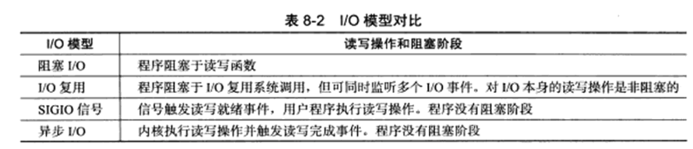
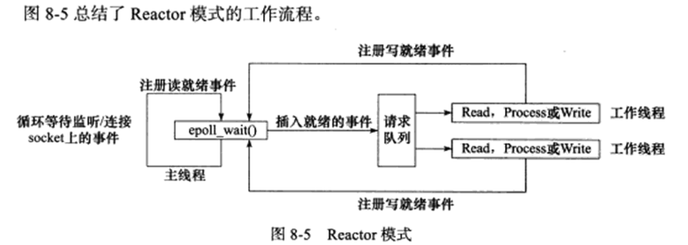
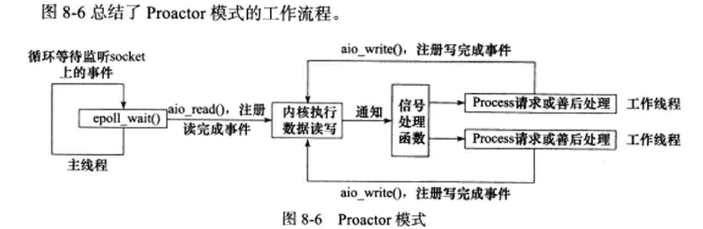
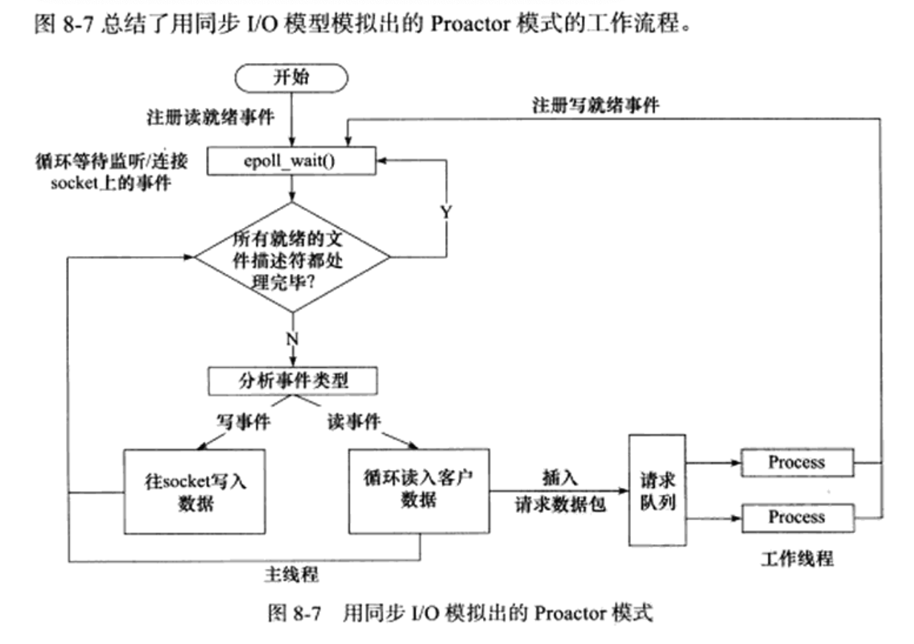
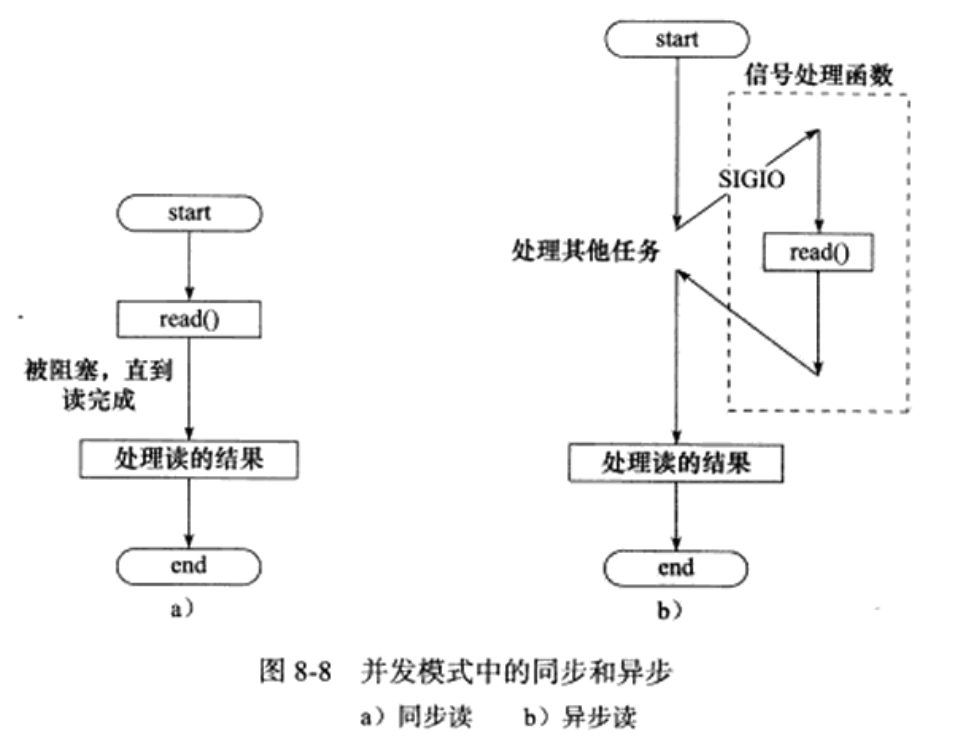
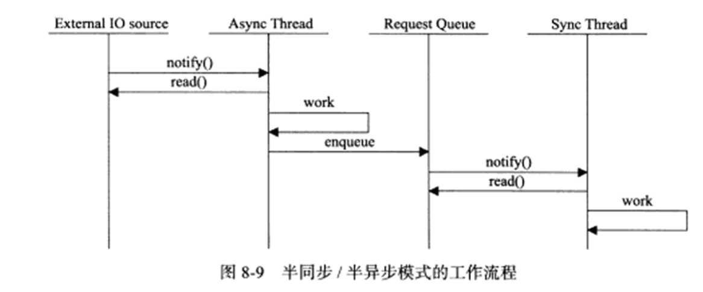
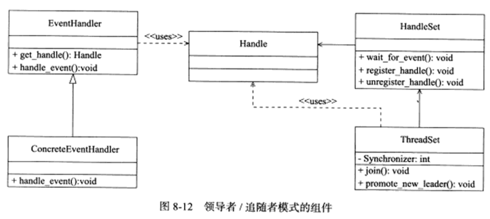
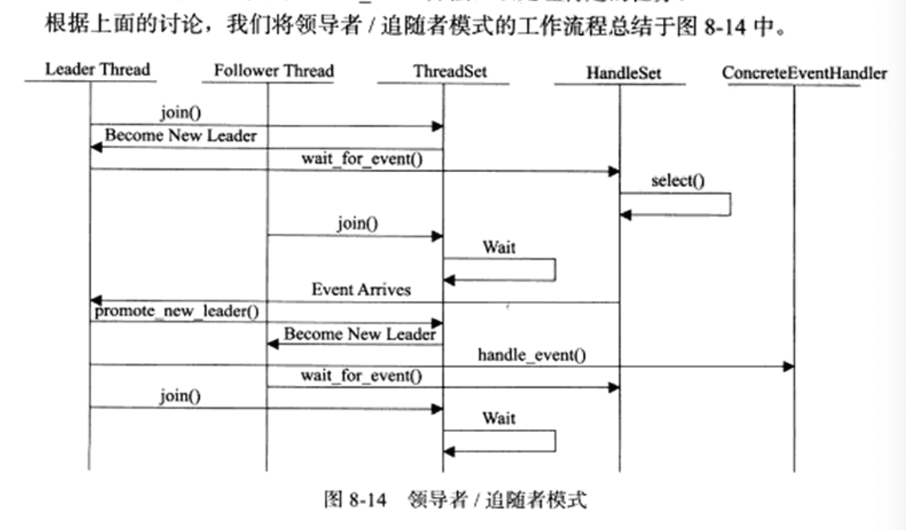

| 模块         | 单个服务器程序             | 服务器集群                   |
| ------------ | -------------------------- | ---------------------------- |
| I/O处理单元  | 处理客户连接，读写网络数据 | 作为接入服务器，实现负载均衡 |
| 逻辑单元     | 业务进程或线程             | 逻辑服务器                   |
| 网络存储单元 | 本地数据库、文件或缓存     | 数据库服务器                 |
| 请求队列     | 各单元之间的通信方式       | 各服务器之间的永久TCP连接    |


## I/O模型
- 阻塞的文件描述符-阻塞I/O
  - 系统调用可能因无法立即完成，而被操作系统挂起，直到等待的时间发生为止
- 非阻塞的文件描述符-非阻塞I/O
  - 系统调用总是立即返回，不管事件是否已发生
    - 如果没有立即发生，则返回-1（跟出错的返回一样-1），此时必须根据errno来区分
      - 对accept、send、recv，事件未发生errno通常设置为EAGAIN(意为：再来一次) 或EWOULDBLOCK(意为：期望阻塞)
      - 对connect，事件未发生errno设置为EINPROGRESS(意为：在处理中)


- 【同步I/O】：I/O的读写操作，都是发生在I/O事件之后，由应用程序完成
  - 阻塞I/O
  - I/O复用：I/O通知机制
    - 应用程序通过I/O复用函数，向内核注册一组事件，内核通过I/O复用函数将其中 就绪的事件通知给应用程序
    - 如：select、poll、epoll_wait
  - SIGIO信号：报告I/O事件
    - 为一个目标文件描述符指定宿主进程，那么指定的宿主进程将捕获到SIGIO信号
    - 当目标文件描述符有指定事件发生时，SIGIO信号的信号处理函数将被触发
- 【异步I/O】：用户可直接对I/O执行读写操作
  - 操作告诉内核 用户读写缓冲区的位置，以及I/O操作完成之后内核通知应用程序的方式


## 事件处理模式

服务器程序通常需要处理一下三类事件：
- I/O事件
- 信号
- 定时事件

两种高效的事件处理模式
- Reactor,  同步I/O模型通常用于实现Reactor模式
  - 要求主线程（I/O处理单元）只负责监听 文件描述上是否有事件发生；有则立即将该事件通知工作线程（逻辑单元）；除此之外，主线程不做任何实质性工作。 读写数据、接受新的连接，以及处理客户端请求均在工作线程中完成
  - 使用同步I/O模型（以epoll_wait为例），实现Reactor模式的工作流程是：
    1. 主线程往 epoll内核事件表中注册 socket上的读就绪事件
    2. 主线程调用epoll_wait等待socket上有数据可读
    3. 当socket上有数据可读时，epoll_wait通知主线程。 主线程则将socket可读事件放入请求队列
    4. 睡眠在请求队列上的某个工作线程被唤醒，他从socket读取数据， 并处理客户请求， 然后往epoll内核事件表中注册该socket上的写就绪事件
    5. 主线程调用epoll_wait等待socket可写
    6. 当socke可写时，epoll_wait通知主线程。 主线程将socket可写事件放入请求队列
    7. 睡眠在请求队列上的某个工作线程被唤醒，他往socket上写入服务器处理客户端请求的结果


- Proactor, 异步I/O模型用于实现Proactor模式
  - 将所有的I/O操作都交给主线程和内核来处理，工作线程仅负责业务逻辑
  - 使用异步I/O模型（以aio_read和aio_write为例），实现Proactor模式的工作流程是：
    1. 主线程调用aio_read函数向内核注册socket上的读完成事件，并告诉内核用户读缓冲区的位置，以及读操作完成时如何通知应用程序
    2. 主线程继续处理其他逻辑
    3. 当socket上的数据被读入用户缓冲区后，内核将向应用程序发生一个信号，以通知应用程序数据已经可用
    4. 应用程序预先定义好的信号处理函数，选择一个工作线程来处理客户请求 
    5. 主线程继续处理其他逻辑
    6. 当用户缓冲区的数据被写入socket之后，内核将向应用程序发送一个信号，以通知应用程序数据已发送完毕
    7. 应用程序预先定义好的信号处理函数 选择一个工作线程来做善后处理，比如决定是否关闭socke




> I/O模型中的“同步/异步”：用于区分内核向应用程序通知的是何种I/O事件（是就绪事件还是完成事件），以及该由谁来完成I/O读写（是应用程序还是内核）


## 两种高效的并发模式
- 并发编程
  - 并发编程目的是让程序“同时” 执行多个任务。
    - 如果程序是计算密集型的，并发编程 并没有优势，反而由于任务的切换使效率降低。
    - 但如果程序是I/O密集型的，比如经常读写 文件，访问数据库等，则情况就不同了。
      - 由于I/O操作的速度远没有CPU的计算速度快，所以让程序阻塞于I/O操作将浪费大量的CPU时间。
      - 如果程序有多个执行线程，则当前被I/O操作所阻塞的执行线程可主动放弃CPU (或由操作系统来调度)，并将执行权转移到其他线程。
      - 这样一来，CPU就可以用来做更加有意义的事情(除非所有线程都同时被I/O操作所阻塞)，而不是等待I/O操作完成，因此CPU的利用率显著提升
  - 实现上：并发编程主要有多进程和多线程两种方式
- 并发模式
  - 指I/O处理单元和多个逻辑单元之间协调完成任务的方法
  - 服务器主要有两种并发编程模式：
    - 半同步/半异步模式【helf-sync/helf-async】
      - 并发模式中"同步"：指程序完全按照代码序列的顺序执行
        - 按照同步方式运行的线程叫 同步线程
        - 按照异步方式运行的线程叫 异步线程
      - 并发模式中"异步"：指程序的执行需要由系统事件驱动，常见的系统事件有中断、信号
      
      

    - 领导者/追随者模式【Leader/Followers】
      - 是多个工作线程轮流获得事件源集合，轮流监听、分发并处理事件的一种模式。
      - 在任意时间点，程序都仅有 一个领导者线程，它负责监听1/ O 事件。
        - 而其他线 程则都是追随者，它们休眠在线程池中等待成为新的领导者。
        - 当前的领导者如果检测到I/O事件，首先要从线程池中推选出新的领导者线程，然后处理I/O事件。此时，新的领导者等 待新的1/0 事件，而原来的领导者则处理I/O事件，二者实现了并发。
    - 领导者/追随者模式包含如下几个组件:句柄集(HandleSet)、线程集(ThreadSet)、时间处理器(EventHandler)、和具体的事件处理器(ConcreteEventHandler)
    
      - 句柄集
      - 线程集
        - Leader：线程当前处于领导者身份，负责等待句柄集上的I/O事件
        - Processing：线程正在处理事件。领导者检测到I/O事件后，可转移到Processing状态来处理该事件，并调用promote_new_leader推选新的leader；也可指定其他追随者来处理事件(Event Handoff),此时领导者地位不变； 当处于Processing状态的线程处理完事件之后，如果当前线程集没有leader，则它将成为新leader，否则它就直接变为追随者
        - Follower：线程当前处于追随者身份，通过调用线程集的join方法等待成为新的leader
      - 事件处理器和具体的事件处理器
        - 通常包含一个或多个回调函数handle_event，这些回调函数用于处理事件对应的业务逻辑
        - 事件处理器在使用前需要绑定在某个句柄上，当该句柄上有事件发生时，领导者就执行与之绑定的事件处理器中的回调函数
        

## 有限状态机
逻辑单元内部的一种编程方法：有限状态机(finite state machine)
- 有的应用层协议头部包含数据包类型字段，每种类型可以映射为逻辑单元的一种执行状态，服务器可以根据它来编写相应的处理逻辑

```c++
  // 状态独立的有限状态机
  // 该状态机的每个状态都是相互独立的，即状态之间没有相互转移
  STATE_MACHINE(Package _pack){
    PackageType _type = _pack.GetType();
    switch(_type){
      case type_A:
        process_package_A(_pack);
        break;
      case type_B:
        process_package_B(_pack);
        break;
    }
  }
```

```c++ 
// 带有状态转移的有限状机
  STATE_MACHINE(){
    State cur_state = type_A;
    while(cur_state != type_C){
      Package _pack = getNewPackage();
      switch(cur_state){
        case type_A:
          process_package_state_A(_pack);
          cur_state = type_B;
          break;
        case type_B:
          process_package_state_B(_pack);
          cur_state = type_C;
          break; 
      }
    }
  }

```
