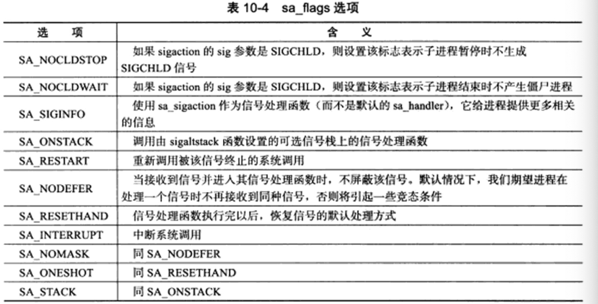

信号是由用户、系统或者进程发送给目标进程的信息，以通知目标进程某个状态的改变或系统异常。

- 对于前台进程，用户可以通过输人特殊的终端字符来给它发送信号。比如输入Ctri+C 通常会给进程发送 一个中断信号。
- 系统异常。比如浮点异常和非法内存段访问
- 系统状态变化。比如alarm定时器到期将引起SIGALRM信号。
- 运行kill命令或调用kill函数。

服务器程序必须处理(或至少忽略)一些常见的信号，以免异常终止。

### 信号函数
- sigacton结构体中的 sa_flags，是用于设置程序收到信号时的行为
