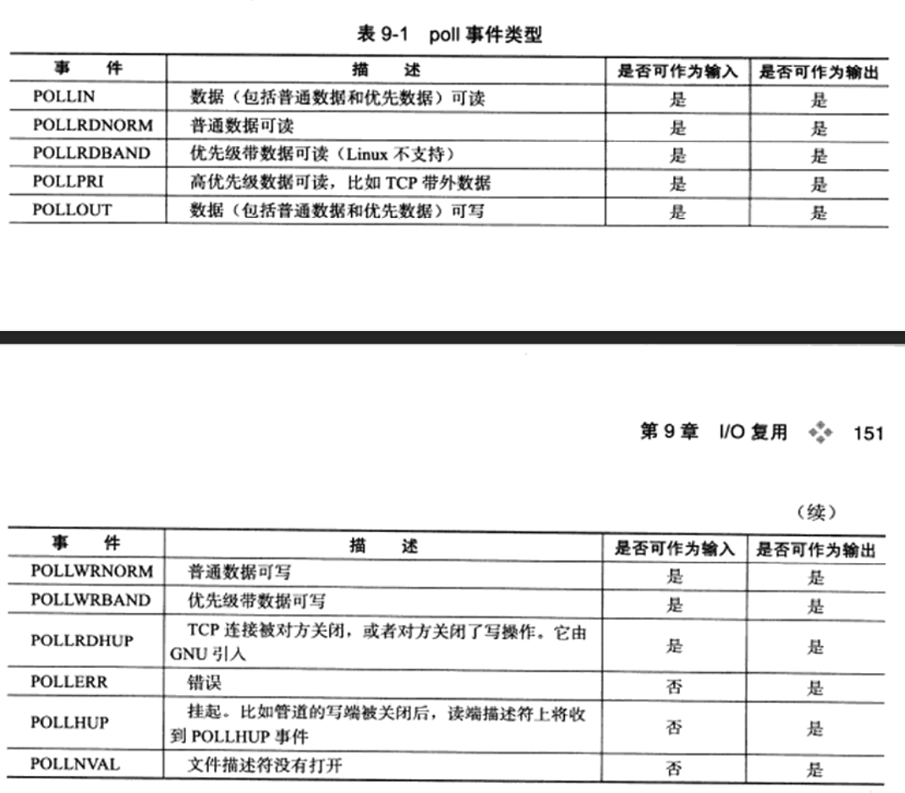
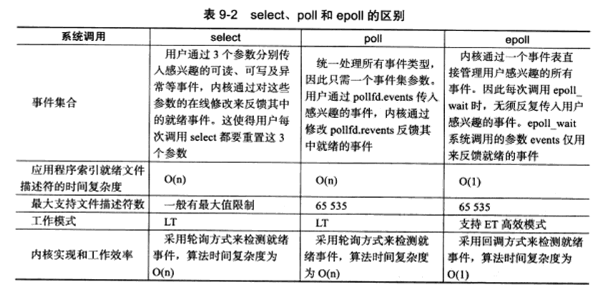

# I/O复用
- 客户端程序要同时处理多个socket 。比如本章将要讨论的非阻塞connect 技术。 
- 客户端程序要同时处理用户输入和网络连接。比如本章将要讨论的聊天室程序。 
- TCP服务器要同时处理监听socket 和连接socket 。这是I/O复用使用最多的场合。
- 服务器要同时处理TCP 请求和UDP 请求。比如本章将要讨论的回射服务器。 
- 服务器要同时监听多个端口，或者处理多种服务。比如本章将要讨论的xinetd服务器

> 需要指出的是，I/O复用虽然能监听多个文件描述符，但它本身是阻塞的。 
> 当多个文件描述符同时就绪时，如果不采取额外的措施，程序就只能顺序依次处理其中的每一个文件描述符，这使的服务器程序看起来像是串行工作的。
> 如果要实现并发，只有使用多进程或多线程等编程手段。

**Linux 下实现I/O复用的系统调用主要有select、poll 和epoll**

## poll

## epoll
    epoll是Linux特有的I/O复用函数。与select、poll有较大差异。
    - 首先：epoll使用一组函数来完成任务，而不是单个函数
    - 其次：epoll把用户关心的文件描述符上的事件都放在内核里的一个事件表中，从而无须像select和poll那样每次调用都重复传入文件描述符集
    - 但：epoll需要使用一个额外的文件描述符，来唯一识内核中的这个事件表
      - 这个唯一文件描述符使用epoll _create函数来创建`#include <sys/epoll.h> int epoll_create(int size)`
      - size参数现在并不起作用，只是给内核一个提示，告诉它事件表需要多大。该函数返回的文件描述符将用作其他所有epoll系统调用的第一个参数，以指定要访问的内核事件表

