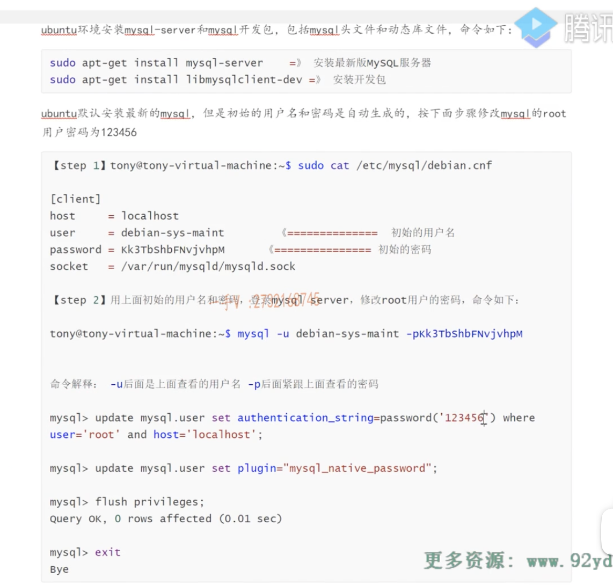

<!--
 * @Author: OCEAN.GZY
 * @Date: 2023-12-10 13:19:02
 * @LastEditors: OCEAN.GZY
 * @LastEditTime: 2023-12-11 12:02:13
 * @FilePath: /c++/oceanim/v0.2/readme.md
 * @Description: 注释信息
-->
- third part
  - 目录：3rds/
  - /json-v3.11.3[c++11 json解析库nlohmann/json.hpp]
  - /muduo-v2.0.3
- mysql 修改root密码
  - 该方式可以mysql -u root -p登录，因为是auth_socket模式
    - ALTER USER 'root'@'localhost' IDENTIFIED BY '123456'; 
  - 该方式可以mysql -h 127.0.0.1 -P 3306 -u root -p登录
    - ALTER USER 'root'@'localhost' IDENTIFIED WITH mysql_native_password BY '123456';
